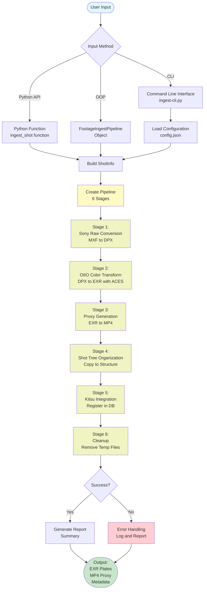
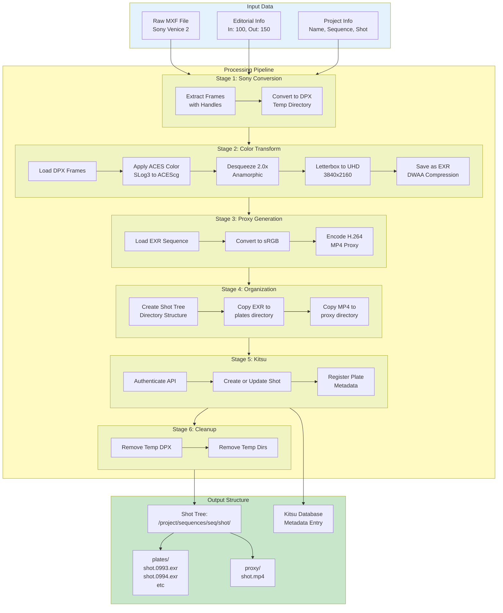
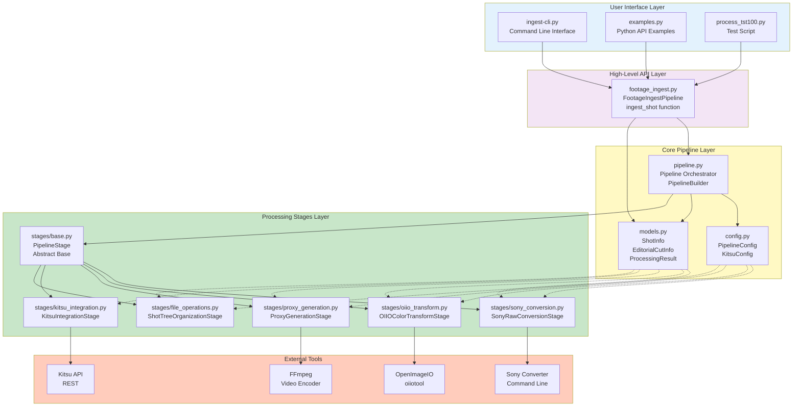
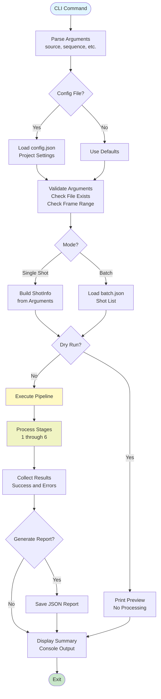
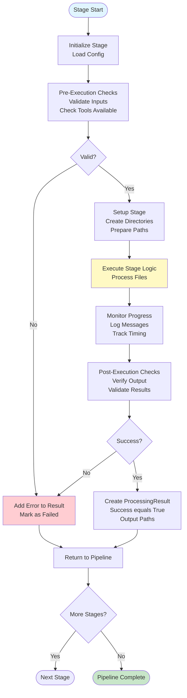
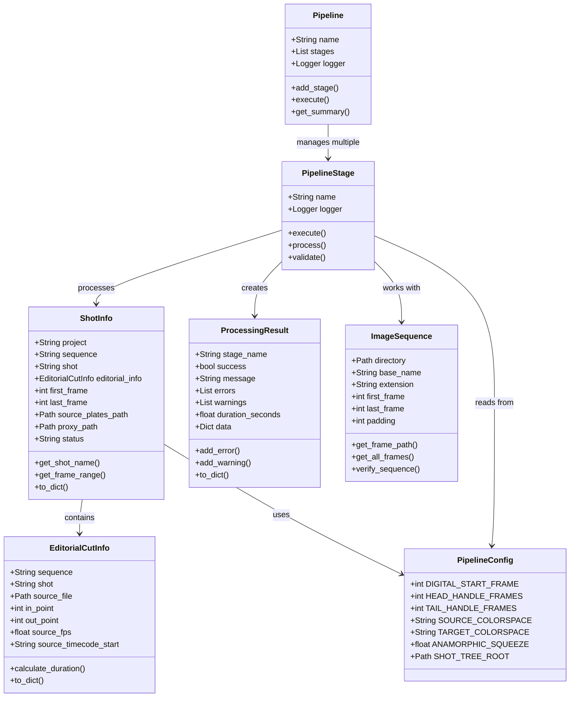
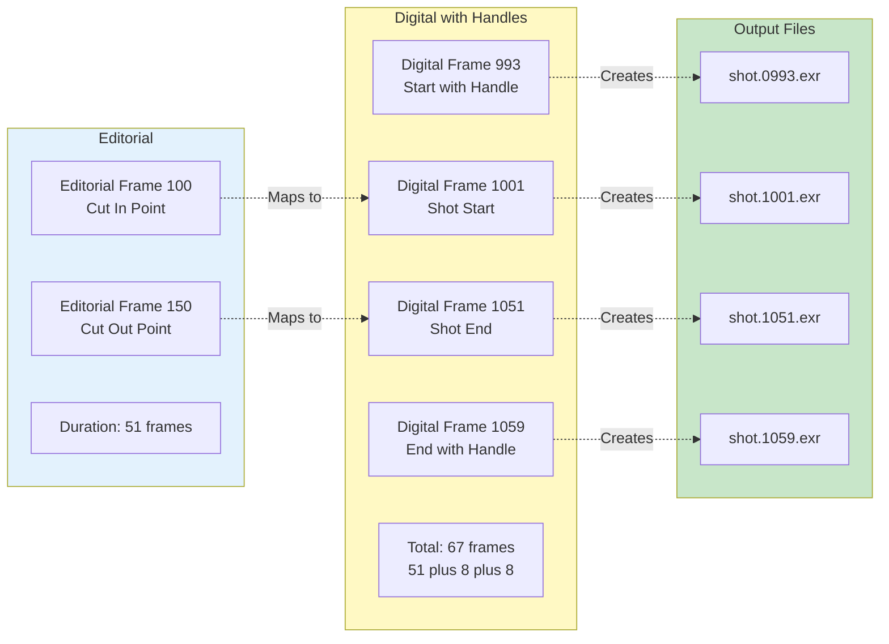
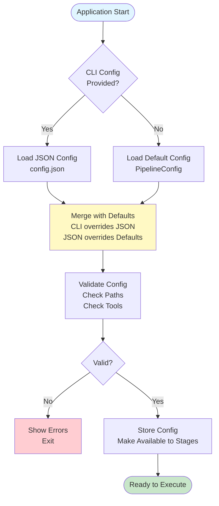
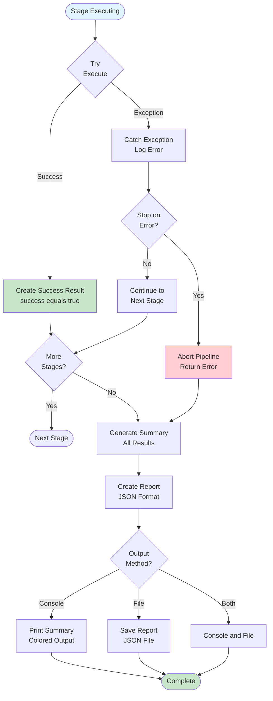

# DED-IO Pipeline Flowcharts

This document contains flowcharts showing the pipeline workflow and codebase structure.

## Table of Contents
1. [High-Level Pipeline Workflow](#high-level-pipeline-workflow)
2. [Detailed Processing Flow](#detailed-processing-flow)
3. [Codebase Architecture](#codebase-architecture)
4. [CLI Execution Flow](#cli-execution-flow)
5. [Stage Execution Flow](#stage-execution-flow)
6. [Data Model Relationships](#data-model-relationships)
7. [Frame Number Mapping](#frame-number-mapping)
8. [Configuration Loading](#configuration-loading)
9. [Error Handling Flow](#error-handling-flow)

---

## High-Level Pipeline Workflow

---

## Detailed Processing Flow

---

## Codebase Architecture

---

## CLI Execution Flow

---

## Stage Execution Flow

---

## Data Model Relationships

---

## Frame Number Mapping

---

## Configuration Loading

---

## Error Handling Flow

---

## Usage: Viewing These Flowcharts

These flowcharts use **Mermaid** syntax, which is supported by:

1. **GitHub** - Displays automatically in README files
2. **VS Code** - Install "Markdown Preview Mermaid Support" extension
3. **Online** - Use https://mermaid.live to view/edit
4. **Obsidian** - Native support
5. **GitLab** - Native support

### To View on GitHub:
Just push this file to your repository and view it on GitHub - the charts will render automatically!

### To View Locally:
1. Install VS Code extension: "Markdown Preview Mermaid Support"
2. Open this file in VS Code
3. Press `Cmd+Shift+V` (Mac) or `Ctrl+Shift+V` (Windows) for preview

### To Export as Images:
1. Visit https://mermaid.live
2. Copy/paste any diagram
3. Click "Download PNG" or "Download SVG"

---

## Legend

**Symbols:**
- Circle with text `([Text])` - Start/End points
- Rectangle `["Text"]` - Process steps
- Diamond `{Text}` - Decision points
- Subgraph - Grouped related items

**Colors:**
- Blue `#e1f5ff` - Input/Start
- Green `#c8e6c9` - Output/Success
- Yellow `#fff9c4` - Processing
- Red `#ffcdd2` - Error/Failure
- Purple `#f3e5f5` - API Layer
- Orange `#ffccbc` - External Tools

**Arrows:**
- Solid line `-->` - Process flow
- Dashed line `-.->` - Data reference
- Labeled arrow `-->|Label|` - Conditional flow
